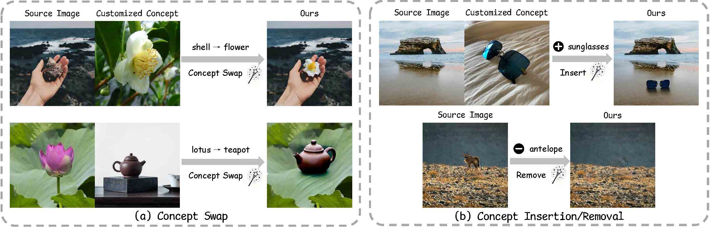
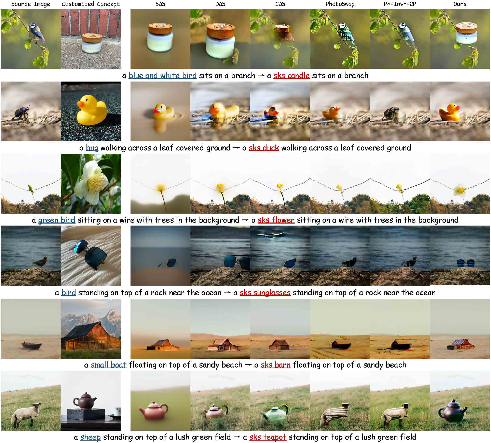

<h2> InstantSwap: 
   
Fast Customized Concept Swapping across Sharp Shape Differences</h2>

[Chenyang Zhu](https://chenyangzhu1.github.io/), [Kai Li](https://kailigo.github.io/), [Yue Ma](https://mayuelala.github.io/), [Longxiang Tang](https://github.com/chenyangzhu1/InstantSwap), [Chengyu Fang](https://chunminghe.github.io/), [Chubin Chen](https://github.com/chenyangzhu1/InstantSwap), [Qifeng Chen](https://cqf.io/) and [Xiu Li](https://scholar.google.com/citations?user=Xrh1OIUAAAAJ&hl=zh-CN&oi=sra)

<strong>Arxiv 2024</strong>

<!--  -->

## ⚡️ Abstract

Recent advances in Customized Concept Swapping (CCS) enable a text-to-image model to swap a concept in the source image with a customized target concept.
However, the existing methods still face the challenges of **_inconsistency_** and **_inefficiency_**. They struggle to maintain consistency in both the foreground and background during concept swapping, especially when the shape difference is large between objects.
Additionally, they either require time-consuming training processes or involve redundant calculations during inference.
To tackle these issues, we introduce InstantSwap, a new CCS method that aims to handle sharp shape disparity at speed.
Specifically, we first extract the bbox of the object in the source image _automatically_ based on attention map analysis and leverage the bbox to achieve both foreground and background consistency. For background consistency, we remove the gradient outside the bbox during the swapping process so that the background is free from being modified.
For foreground consistency, we employ a cross-attention mechanism to inject semantic information into both source and target concepts inside the box.
This helps learn semantic-enhanced representations that encourage the swapping process to focus on the foreground objects.
To improve swapping speed, we avoid computing gradients at each timestep but instead calculate them periodically to reduce the number of forward passes, which improves efficiency a lot with a little sacrifice on performance.
Finally, we establish a benchmark dataset to facilitate comprehensive evaluation. Extensive evaluations demonstrate the superiority and versatility of InstantSwap.

## 📣 Updates

- **[2024.12.2]** 🔥 Release Paper and Project page!

## Results 🎉

More results can be found in our [Project page](https://instantswap.github.io/).

## Citation 📄

## Acknowledgement 🙏

This repository borrows heavily from [Prompt-to-prompt](https://github.com/google/prompt-to-prompt) and 🤗[Diffusers](https://huggingface.co/docs/diffusers/main/en/index). Thanks to the authors for sharing their code and models.

## Contact ✉️
This is the codebase for our research work. We are still working hard to update this repo, and more details are coming in days. If you have any questions or ideas to discuss, feel free to contact [Chenyang Zhu](chenyangzhu.cs@gmail.com).

## Star History

[get_bbox]: get_bbox.sh
[InstantSwap]: InstantSwap.sh
[setup]: setup_env.sh
